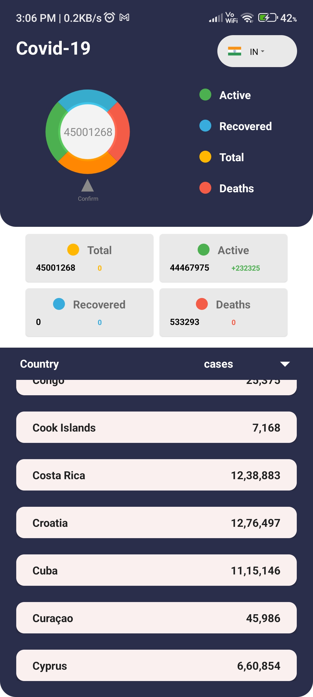
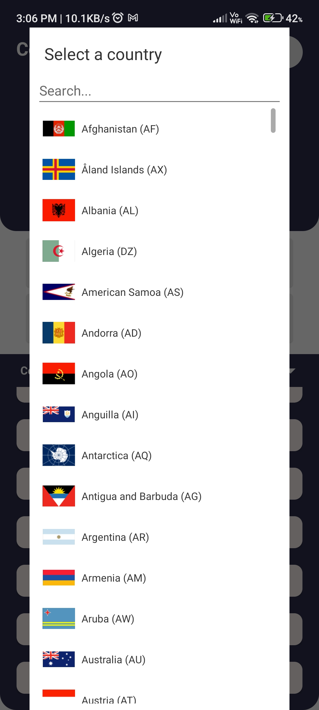

# Android Crypto Tracker App

## Overview
The Android Crypto Tracker App is a mobile application that allows users to track and visualize COVID-19 statistics, including cases, deaths, recoveries, and active patients, on a country-by-country basis. The app uses Java for Android development and Retrofit for making API requests to fetch the latest data.

## Features
- View COVID-19 statistics (cases, deaths, recoveries, and active patients) by country.
- Search for a specific country to get detailed information.
- User-friendly interface with easy navigation.
- Up-to-date data retrieved from a reliable data source.

## Screenshots

## How to Use
1. Clone the repository to your local machine:
